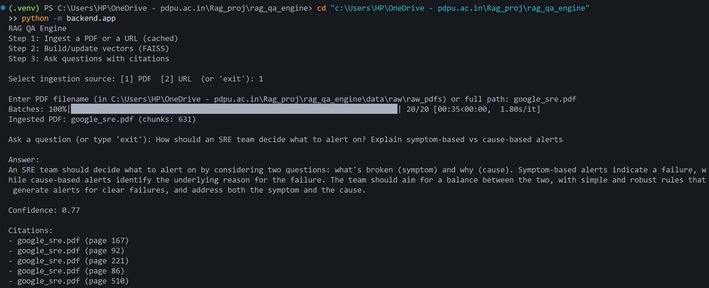

# RAG QA Engine

A small Retrieval-Augmented Generation (RAG) project for learning how real RAG pipelines work end-to-end.

It ingests PDFs (and web pages), chunks and embeds the text, stores embeddings in a local vector index, and answers questions using an LLM **only with retrieved context** (with citations).

## Screenshot



More screenshots are available in the [doc/](doc) folder.

## What it does

- Ingest **PDFs** (upload in the UI) and **URLs**
- Extract + clean text, then **chunk** it
- Create **embeddings** (SentenceTransformers: `all-MiniLM-L6-v2`)
- Store/search vectors using a persisted **FAISS** index in `data/vectors/`
- Retrieve top-k chunks and build a grounded prompt
- Generate an answer via an LLM (Groq) and show **citations**

## Project structure (high level)

- `streamlit_app.py` — Streamlit UI
- `backend/ui_api.py` — thin API used by Streamlit (ingest/ask/clear)
- `backend/ingestion/` — PDF + web ingestion and caching
- `backend/processing/` — chunking
- `backend/embeddings/` — embedding model + FAISS vector store
- `backend/retrieval/` — retrieval logic
- `backend/llm/` — prompt building + LLM client + answer guard
- `backend/evaluation/` — simple confidence scoring + source attribution
- `data/raw/` — stored raw inputs (PDFs, extracted text, cached web)
- `data/vectors/` — persisted vector index + records

## Setup

### 1) Create a virtual environment (Windows)

```powershell
python -m venv .venv
.\.venv\Scripts\Activate.ps1
python -m pip install --upgrade pip
pip install -r requirements.txt
```

### 2) Configure the LLM API key

This project uses Groq for the LLM.

Option A — `.env` file in the project root:

```env
GROQ_API_KEY=your_key_here
```

Option B — PowerShell environment variable:

```powershell
$env:GROQ_API_KEY = "your_key_here"
```

## Run

Start the Streamlit app:

```powershell
streamlit run streamlit_app.py
```

In the sidebar:

1. Ingest a PDF or URL
2. Ask questions and adjust `Top-K`
3. Clear vector data when you want a fresh index

## Where data is stored

- Raw PDFs: `data/raw/raw_pdfs/`
- Extracted/normalized text: `data/raw/raw_text/`
- Cached web text: `data/raw/raw_web/`
- Vector index + records: `data/vectors/`

## Notes / troubleshooting

- **“Missing GROQ_API_KEY”**: set `GROQ_API_KEY` and re-run.
- **FAISS import errors**: the code uses FAISS (`import faiss`). If your environment doesn’t have it, install a CPU build:

	```powershell
	pip install faiss-cpu
	```

	If `pip` fails on Windows, using Conda can be easier:

	```powershell
	conda install -c conda-forge faiss-cpu
	```

- PDF extraction quality depends on the PDF (scanned PDFs may need OCR).

## Why this project

The goal here is learning: understanding RAG architecture, embeddings + vector search, prompt grounding, and the practical issues you hit with chunking and retrieval.

